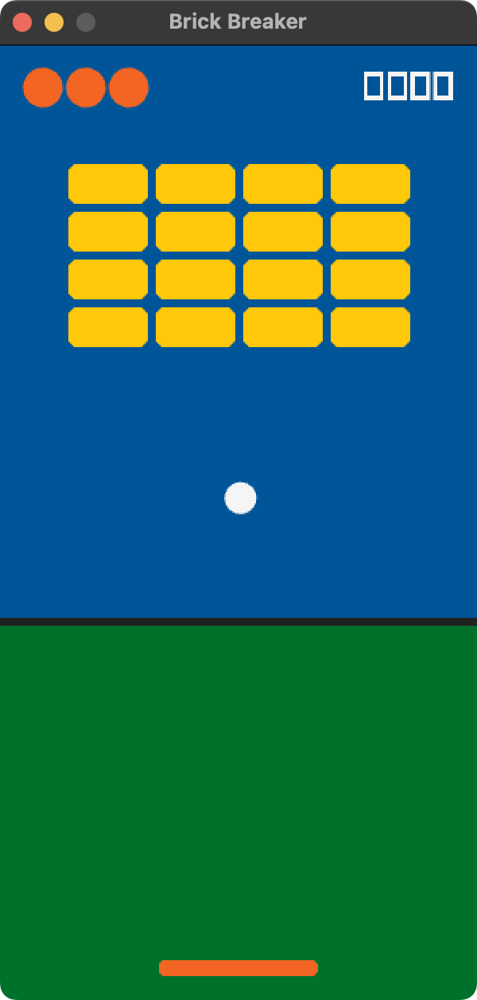
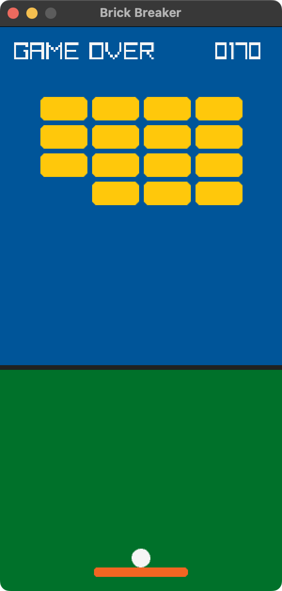
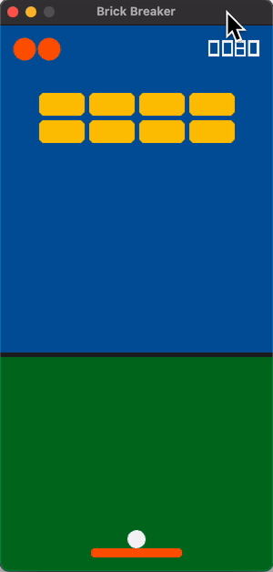

# Go Breaker


## Description

Go Breaker is a classic Brick Breaker game where you control a paddle to bounce the ball and destroy every brick. Built with Go (Golang), Raylib, and the Yoga Layout Engine for smooth gameplay and a responsive UI.

## Features

- 🧱 Classic Brick Breaker gameplay
- 🎮 Smooth paddle and ball controls
- ⚡ Built with Go (Golang)
- 🎨 Powered by Raylib for 2D graphics
- 📐 Responsive UI powered by Facebook's Yoga Layout Engine.
- 💻 Lightweight and cross-platform
- 🚀 Fast startup and high performance

## Requirements

- Go 1.24 or later
- Raylib
- A C compiler (required by Raylib)

## Build

Clone the repository:

```bash
git clone https://github.com/husnulhamidiah/goarkanoid.git
cd goarkanoid
```

Run the game:

```bash
go run .
```

Or build an executable:

```bash
go build
```

## Controls

| Key | Action |
|------|--------|
| **← Left Arrow** | Move paddle left |
| **→ Right Arrow** | Move paddle right |
| **Space** | Start the game |
| **M** | Mute / Unmute |

## Screenshots

<div style="display: flex; gap: 10px;"> 
     
     
    
</div>

## License

This project is licensed under the MIT License. See the [LICENSE](LICENSE) file for details.
